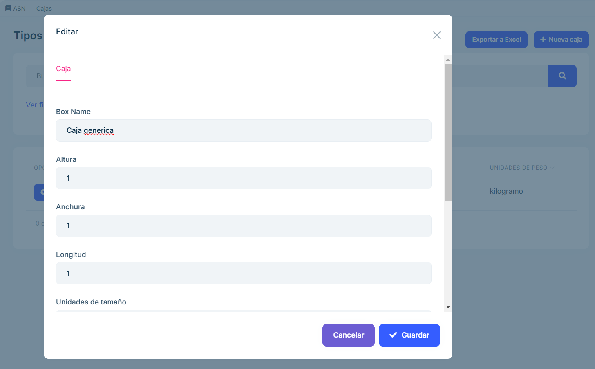

# Boxes

**Overview**

The Boxes section allows you to manage all the boxes registered in the system. Users can search, filter, edit, delete, export and create new boxes in an intuitive way. This module is designed to ensure an efficient administration of the cashboxes and their characteristics.

**2.2.2.2.2 Main functionalities **

## Search engine

The search field allows to quickly locate boxes by entering text related to their main characteristics, such as name, type of box or any other relevant data.

## Advanced Filters

The Advanced Filters drop-down allows you to perform more specific searches by applying different criteria.

The available criteria include:

- Box code.
- Minimum height.
- Maximum height.
- Minimum width.
- Maximum width.
- Minimum length.
- Maximum length.
- Size units.
- Minimum weight.
- Maximum weight.
- Weight units.
- Orders.
- Order object.

Once the filters have been configured, users can press the Refresh button within the panel to have the list of boxes automatically refreshed, showing only the results that meet the selected criteria.

Screenshot_2025-01-14_144650](images/filterBox.png)

## List of Boxes

- A table with all the existing boxes in the system is displayed.

- Each row of the list represents a box and includes information such as:
   
    - Box code.
    - Dimensions (height/width/length).
    - Size units.
    - Weight (G/N).
    - Weight units.

Screenshot_of_2025-01-14_145112](images/listBox.png)

- Each box has two associated action buttons:

Edit: Open a form to modify the characteristics of the selected box.

Delete: Delete the box from the system after confirming the action.

Screenshot_2025-01-14_145222](images/alertBox.png)

## Export to Excel.

- Clicking on the Export to Excel button will automatically download an Excel file with the information of the boxes shown in the listing.

- The downloaded file is saved in the browser's default download folder.

## Create New Box

- This button allows registering a new box in the system.

- When selected, a form is displayed in which users must enter the required information:

    * name of the box: an identifying name that allows the box to be easily recognized. Example: "Large Box #1", "Electronic Box". Helps to quickly organize and locate the box in an inventory or management system. 

    * Width: The horizontal measurement of the box when viewed from the front. The units can be specified in centimeters, inches, meters or other units depending on the configuration. For example: 30 cm, 12 inches. Key to determining the space the box will occupy, especially in storage or transport. 

    * Height: The vertical measurement of the box from the base to the top. The units of measurement are similar to the width, specified in cm, inches, etc. This data is necessary to calculate the total volume of the box and to verify its adequacy in spaces with height restrictions. 

    * Length: The horizontal measurement of the box from front to back. It is measured in the same units as width and height. Example: 40 cm, 16 inches. Along with width and height, it determines the volume and space required for storage. 

    * Size units: Specifies the measurement system used for the dimensions of the box. Example: Centimeters (cm), inches (in), meters (m). It unifies measurements and avoids errors when mixing different unit systems. 

    * Gross weight: The total weight of the box, including its contents, packaging and any additional material. Units: Kilograms (kg), pounds (lb), etc. Example: 12 kg, 26 lb. It is essential for calculating transportation costs and complying with maximum weight regulations. 

    * Net weight: The weight of the contents of the box excluding packaging. Units: Same unit as gross weight (kg, lb, etc.). Example: 10 kg, 22 lb. Useful for determining the value of the contents, especially in trade and inventory. 

    * Weight units: System of measurement for weight (kilograms, pounds, etc.). Example: kg, lb. Ensures consistency in measurements and avoids interpretation errors, especially in international contexts. 

- The form includes validations to ensure data integrity before saving.

    These fields together ensure that boxes can be properly identified, measured, weighed and transported. They facilitate logistics, warehousing, inventory and trade by providing all key information about the physical characteristics of each box. 

    <b>The box needs to be created here so that it is recorded in the system and can be available later in the packaging section, ensuring that the correct specifications are used in downstream processes.</b>

! [Screenshot_2025-01-14_145603](images/newBox.png)

## Frequently Asked Questions

<b>What information is displayed in the box listing?</b>

The box listing shows key information for each registered box, including:

- Unique box code.
- Dimensions (width, length, height).
- Size units.
- Weight units.
- Weight units.

<b>How can I search for a specific box</b>

You can search for a specific box using the search field. Enter any of the following data:

- Box code.
- Order number.
- Dimensions or any other relevant characteristics.

<b>How can I edit or delete a box?</b>

Each box in the listing includes two buttons:

Edit: Allows you to modify the characteristics of the box. When clicked, it opens an editable form.

Delete: Deletes the box from the system. This action requires confirmation to avoid accidental deletions.

<b>How can I register a new box?</b>

To create a new box:

Click on the Create New Box button.
Complete the form with the required data (dimensions, material, condition, etc.).
Save the changes to register the box in the system.

<b>What happens if I try to save a box with incorrect data?</b>

The create and edit form includes validations to ensure data integrity. If you enter incorrect information or missing required fields, the system will display an error message indicating the necessary adjustments before saving.

<b>What to do if I cannot find a box that should be registered?</b>

If you cannot find a box: 

Verify that no filters have been applied that may be hiding it. 
Try searching for it by its unique identifier or code or other distinguishing characteristic. 
If the box still does not appear, confirm with your system administrator whether it has been deleted or archived.
l doesn't appear, confirm with your system administrator whether it has been deleted or archived.

<b>How to create an Excel document? </b>

Click on the Export to Excel button at the top right. An Excel file will automatically download with 
the information of the boxes shown in the list.