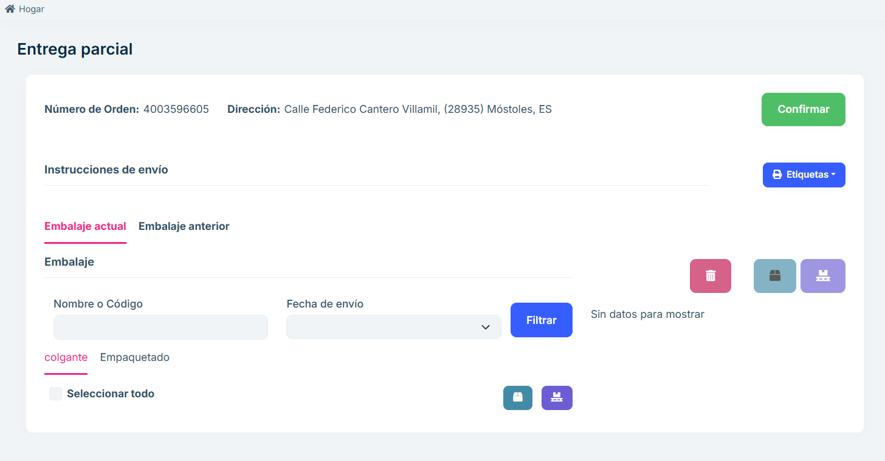
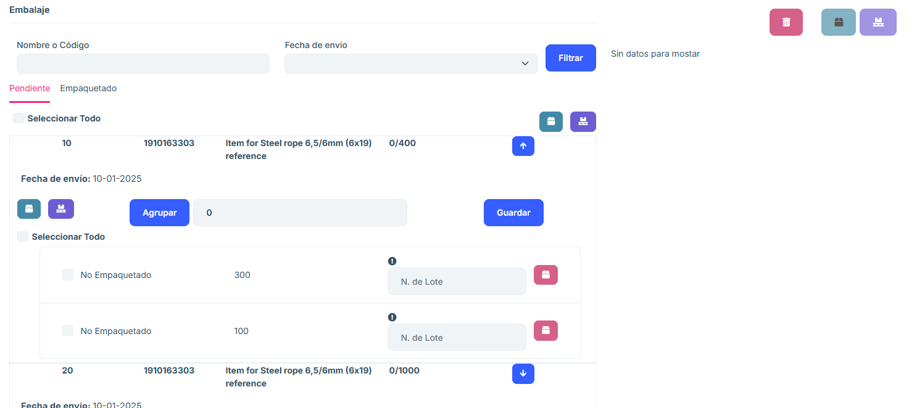

# 2.2.7 Envíos parciales

**2.2.7.1 Descripción general**

El apartado Envíos Parciales permite gestionar y consultar los pedidos que se encuentran en proceso de envío parcial. Es decir, aquellos pedidos de compra de los cuales se han empaquetado previamente algunos ítems, pero no todos. 

Proporciona herramientas para órdenes de pedidos y visualizar sus detalles, así como gestionar los embalajes asociados. 

**2.2.7.2 Funcionalidades principales**

#### 2.2.7.2.1 Buscador de pedidos por número de orden y dirección del pedido. 

Presionar el botón Actualizar para filtrar el listado de pedidos por los datos introducidos o presionar el botón Limpiar para vaciar los campos rellenes del buscador.

#### 2.2.7.2.2 Listado de Órdenes de Pedidos

- Muestra todas las órdenes de pedidos en estado de envío parcial.

- Cada fila incluye información clave como:

   - Número de Orden: Identificador único del pedido.
   - Dirección de envío: Destino asociado a la orden.
   - Cajas: número de cajas contenidas en el pedido.
   - Opciones: cada orden de pedido en el listado incluye un botón Nota de Entrega. Al presionar este botón, el usuario es redirigido a una nueva pestaña para gestionar los embalajes asociados a la orden seleccionada.
   
#### 2.2.7.2.3 Importar

Presionando el botón Importar se abre una pestaña desde la que se puede, o bien arrastrar archivos Excel para poder añadir al listado, o bien, añadir desde el propio navegador de archivos del ordenador.

#### 2.2.7.2.4 Pestaña Nota de Entrega

- Embalaje actual

- Buscador de embalajes

   Criterios de búsqueda:

   - Nombre o código del embalaje.
   - Fecha de envío.
   - Botones de acción:
   
      Filtrar: Filtra el listado de embalajes según los criterios ingresados.

- Listado de embalajes.

   Muestra los embalajes asociados a la orden de pedido seleccionada.

   Cada fila del listado incluye información como:
   - Nombre o código del embalaje.
   - Fecha de envío
   - Otros detalles relevantes del embalaje.

El funcionamiento del apartado "Delivery Note" consiste en el mismo esquema de empaquetados que en la sección de "Empaquetar" de este documento. 

#### 2.2.7.2.5 Embalaje previo 

En la sección de embalaje previo se muestra lo que ya se ha empaquetado de ese pedido, y la cantidad que muestra en embalaje actual es la cantidad pendiente, es decir, que para una posición del pedido la cantidad total sería la de embalaje actual + embalaje previo, pero el sistema las separa. 

#### 2.2.7.2.6 Preguntas frecuentes

<b>¿Qué información muestra el listado de órdenes de pedidos?</b>
 
El listado de órdenes de pedidos muestra las siguientes columnas clave:

   - Número de Orden: Identificador único del pedido.
   - Dirección de envío: Destino asociado a la orden.
   - Cajas: número de cajas contenidas en el pedido.
   - Opciones: cada orden de pedido en el listado incluye un botón Nota de Entrega. Al presionar este botón, el usuario es redirigido a una nueva pestaña para gestionar los embalajes asociados a la orden seleccionada.
   
<b>¿Cómo puedo buscar un pedido específico?</b>

Puedes usar el buscador ubicado en la parte superior de la ventana:

Ingresa el Número de Orden o la Dirección de Envío en los campos correspondientes.
Haz clic en el botón Actualizar para filtrar los resultados.
Si deseas limpiar los campos de búsqueda, utiliza el botón Limpiar.

<b>¿Qué hace el botón "Nota de Entrega"?</b>

El botón Nota de Entrega redirige a una nueva pestaña donde puedes:

Consulte los embalajes asociados al pedido seleccionado.
Utilizar un buscador adicional para localizar embalajes por:
   - Nombre o Código
   - Fecha de envío
   - Visualice un listado con los embalajes y sus detalles específicos.

<b>¿Qué información muestra el listado de embalajes?</b>

El listado de embalajes incluye:

Nombre o Código del Embalaje: Identificador único del embalaje.
Fecha de envío: Fecha en la que se procesó o se programó el envío del embalaje.
Detalles adicionales: Otros datos relevantes.

<b>¿Cómo sé si un pedido está parcialmente enviado?</b>

En el listado principal, los pedidos mostrados en el apartado Envíos Parciales corresponden únicamente a aquellos que no han sido enviados completamente. Cada pedido en esta sección tiene asociado un estado de "Parcial".

<b>¿Qué hacer si un pedido no aparece en el listado?</b>

Si no aparece un pedido:

Verifica que hayas ingresado los datos correctos en el buscador.

Asegúrese de haber hecho clic en el botón Actualizar tras ingresar los criterios de búsqueda.
Si el problema persiste, contacte al administrador del sistema para verificar si el pedido ha sido completado o archivado.

<b>¿Cómo subir un archivo Excel propio al listado?</b>

Presione el botón Importar. Se desplegará una pantalla desde la cual podrá arrastrar su archivo dentro de la casilla central habilitada para tal efecto. O bien, dentro de esta misma pantalla, presione la pestaña Elegir Archivos para poder elegir el archivo deseado desde el navegador de archivos de su propio ordenador.