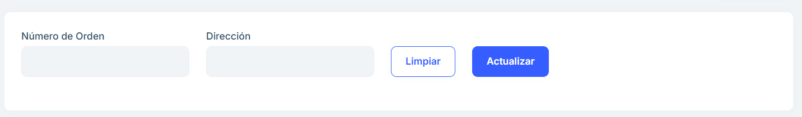
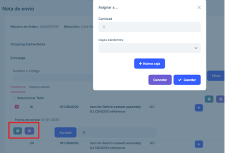
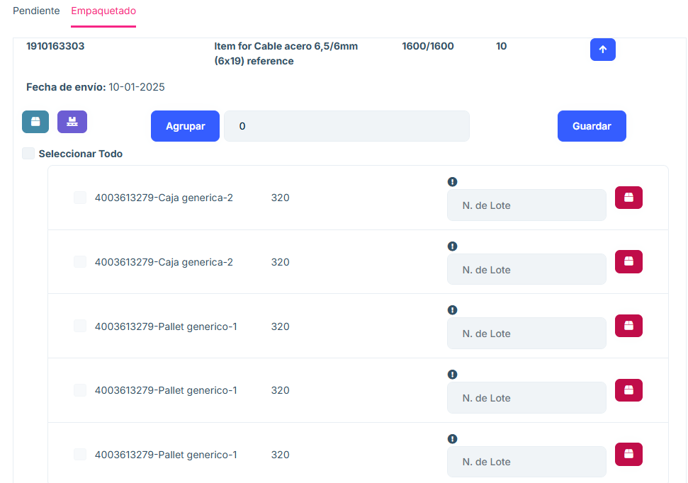
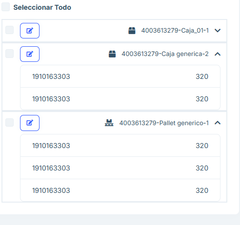
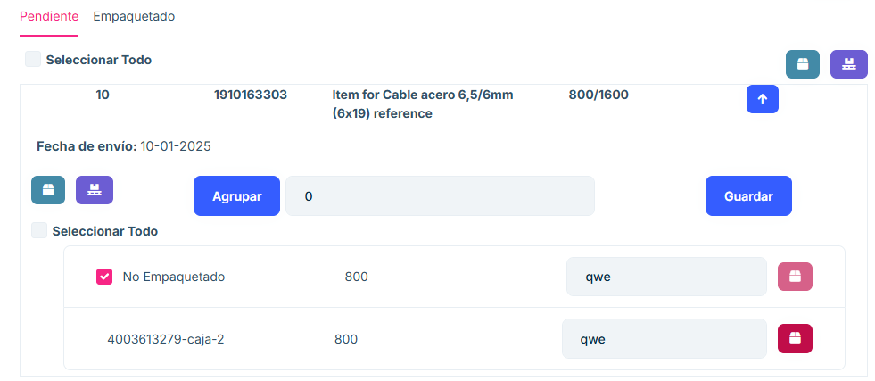
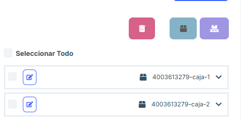
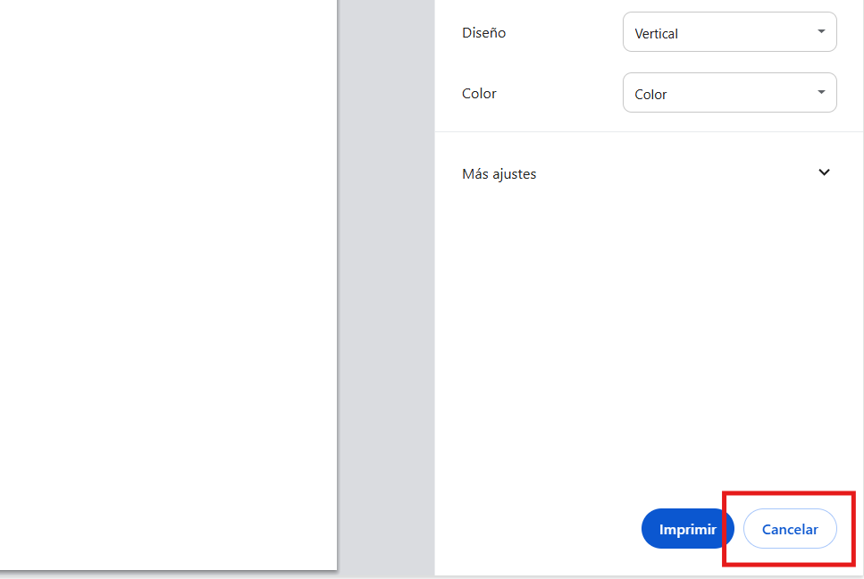

#  2.2.5 Packing

**2.2.5.1 Overview**

In the "Packing" section we have access to orders that have been previously confirmed in the Jaggaer system, have been received by the ASN 2.0 system and are ready to start the packing process.  

In this section, only individual orders can be selected. If we want to put boxes from different orders together, this can be done later in the application.   

The Packing section displays a list of the packages made, providing the order number, the address and the plant to which it is sent, the number of boxes that have been packed, the pallets and a "Delivery Notes" option button. 

**2.2.5.2 Main Features**

#### 2.2.5.2.2.1 Search Engine

- Allows searching the listing by order number and shipping address attributes.

#### 2.2.5.2.2.2 Delivery Note

- Clicking the "Delivery Notes" button on any of the packages displays the Delivery Note page where you can see the package that is pending packing or already packed. 

-  The order position (in this case 10) 

- The order floor (in this case 40SY) 

- The item number (in this case 1910163349) 

- The item name (Item for BG140 safetygear contact reference) 

- The number of items to be packed (0/140) - The 

 date of shipment. 

#### 2.2.5.2.2.3 Pending

- If the package is set as pending, a menu is displayed where you can choose the number of pallets and boxes to be packed, grouping the number of items to be packed until the total number of items to be shipped is reached.

- The number of items per box or pallet must be entered and the application itself provides a list with the groups of items. A lot number identifying the package can be proposed.

#### 2.2.5.2.2.4 Boxes

- You can choose if you want to create boxes with the items.

- A menu appears that allows you to insert the chosen items in an existing box searched in the search engine or create a new box and insert the chosen items in it.

- In case of not placing the number of groups to pack the menu to pack appears with the total number of batches to pack.

- To create a box press "+ New box" and this menu appears. You can assign a box to each item or assign a box to all items by clicking on the tick above the menu.

#### 2.2.5.2.2.5 Pallets

- To pack the items in pallets it will be necessary to choose the desired lots from the list and press the button to group them in pallets.

- In the same way as the boxes, when converting them into pallets a menu appears that allows you to put them in an existing pallet or create a new pallet to store them there.

- To create a pallet press "+ New pallet" and this menu appears. You can assign a pallet to each item or assign a pallet to all items by clicking on the tick above the menu.

#### 2.2.5.2.6 Pack an item

- You can select an entire item, or several items, and pack it in its entirety using the pallet and box buttons on the right. To select it, use the check box on the left side of the item. This option is only available for items in which no subdivision of items has been generated. With the "Select all" option we will select all items that can be selected for packing in this way.

#### 2.2.5.2.7 Packing

- As soon as all items in the "Pending" section are put into boxes or pallets they appear in this list, providing the possibility to unpack the items in the list.

 You can unpack any of the items using the following icon. 

#### 2.2.5.2.8 List of packages

- On the right side of the page there is a list of boxes and pallets created for shipment. You can edit the data of the pallet or box itself and view the items that compose it.

- Selecting one of the items in this list allows you to delete them and if they are boxes allows you to put them in a box or pallet.

image](images/optionsPackPackPacket.png)

<b>In case of confirming the order but not finishing packing the whole list of items, the list of pending items will appear in the list of the "Partial shipments" section of the application. </b>

By using the "Labels" button you can get a pdf of the existing items and boxes.

#### 2.2.5.2.9 Single level packing 

- The same item can be packed in different ways: 

- When you apply to the checkbox using the box or pallet buttons on the right you could pack the whole item. 

- If you want to pack more than one position at the same time you can checkbox as many positions as you want.

#### 2.2.5.2.9.1 Two-level packaging

- The packages that are created will appear in a tree on the right side of the screen. With these packages if we click on the pencil a form will appear to edit them.  

- When selecting several packages we can click the box/pallet button and insert the selected packages into a second package. As a general rule this will be done by pressing the pallet button to palletize boxes.  

- At any time we can select as many pallets and boxes as we want and delete them by pressing the trash can button. If we delete a package with items inside, they are unpacked.

- If we delete a package with packages inside, the child packages will not be deleted.

- In this screen we can remove the first level labels by clicking on “Labels” and then on “Box Labels”. 
With this button we will get the labels of Boxes and Pallets that contain items. 

- Above the list of items we see the pending and packed tabs. In “Pending” appear those items that have not yet been fully packed. In “Packed” those that have been fully packed. 

image](images/imagendeWord.png)

- To move what has been packed to the “Pending Shipment” tab, click the “Confirm” button.  

- This will move the packing you have done to the next section. It will not be possible to go back to the “Packing” window for those boxes and pallets that are confirmed. 

#### 2.2.5.2.2.10 Packing with batch number 

The items should be grouped and in each group the batch number, certificate number and date of manufacture should be entered manually. If the batch number or certificate number is missing, the order cannot be confirmed, it can be completed in the “Packaging” section and the order can be confirmed.  

If you enter a certificate or lot number in the wrong format, a message will appear advising the correct format: 

If the format is correct, it will look like this: 

#### 2.2.5.2.11 Packing with many positions 

In this case you can take all items and pack each one in a box. In case you need a lot number, it will not allow packing in this way if it is not placed manually. 

From the list of packed items you can add them on pallets. You can remove the labels from the shipments. 

#### 2.2.5.2.12 Packing with serial number 

When there are items in the order that require serial number, a button will appear above the list of items that allows to enter large quantities of serial numbers in a short time. 

When the button is clicked, a window opens that allows us to choose for which type of item we want to enter serial numbers. 

When you select an item, a text field will appear where you can enter the serial numbers. 

They can be separated by line breaks or by semicolons (“;”). 
It will be necessary to enter all the serial numbers that are required, above the text field we can see how many serial numbers we have entered and what is the total required. 

After clicking “Save” if there has been any problem the application will warn us. If everything has gone well, the serial numbers of the chosen item type will have been saved.

#### 2.2.5.2.2.13 Box/Pallet Form

- Once we click on the box or pallet button this box will be displayed where we can decide if we want to enter the items in a box previously created in this order or if we prefer to create a new box by clicking on the “+ New box/pallet” button 

! [image](images/imagendeWord.png)

- If we press new box/pallet we will see this box or pallet creation form (depending on the button pressed). In this form when choosing a box/pallet type we will be selecting one of the generic types previously created. The fields will be autocompleted with the information of the previously created box/pallet, however any field can be modified. 

- At the top of the form there are two checkboxes to select if we want to create a single package for all the selected items or if we want to create a package for each item.  

image](images/imagendeWord.png)

- If we want to create different packages for the same position we can use the “Group” option. Packages will be created according to the number we indicate once we press the “Group” button 

- The subpackages that have been created after pressing the “Group” option can be packed using the box or pallet buttons that appear when the position is displayed. 

- Once an item is packed we can either unpack it by clicking the box button or delete it by clicking the trash can button.  

- If we press the box or pallet buttons inside the item without selecting any subpackage generated after grouping we can indicate the quantity we want for the new package we are going to create.

#### 2.2.5.2.13 Frequently Asked Questions 

<b>How to search for an order? </b>

At the top of the page there is a search engine that allows you to search by any of its main attrib
utes. 

<b>How do I leave a pending package in the packaging section? </b>

Each item has a list of the products to be packaged, it must be grouped into a group and the 
products must be chosen to be put into boxes or on pallets depending on what is desired. 

This will cause it to show up in the listing on the right side of the page and in the packaging section, 
ready for you to confirm. 

<b>Why does the website not work when I remove a tag? </b>

If you remove a tag, you must cancel the tag to continue working on the website. 

