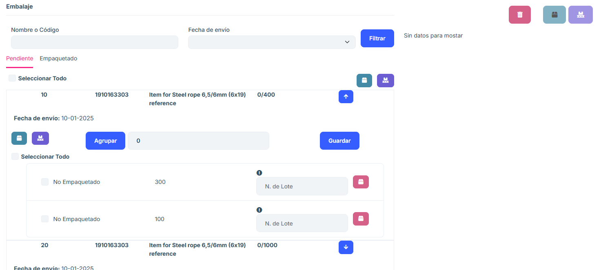
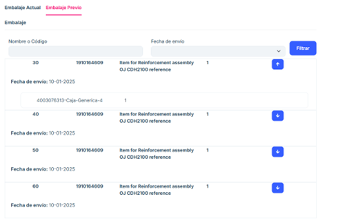

# Partial Shipments

**General description**

The Partial Shipments window is identical to the Packing window, except that here we can access to continue with the delivery note for those purchase orders in which we have previously confirmed only some of the items in the “Packing” section.

**Main features**

## Delivery Note tab

- Package search

Search criteria:

- Package name or code.
- Shipping date.
- Action buttons:

Filter: Filters the list of packages according to the entered criteria.

- Package list.

Shows the packages associated with the selected purchase order.

Each row of the list includes information such as:
- Package name or code.
- Shipping date
- Other relevant details of the package.

The "Delivery Note" section works in the same packaging scheme as in the "Packing" section of this document.

## Pre-packing

The pre-packing section shows what has already been packed for that order, and the quantity shown in current packaging is the pending quantity, that is, for an order item the total quantity would be the current packaging + pre-packing, but the system separates them.

## Frequently asked questions

<b>What information does the order order list show?</b>

The order order list shows the following key columns:

- Order Number: Unique identifier of the order.
- Shipping address: Destination associated with the order.
- Boxes: number of boxes contained in the order.
- Options: each order in the list includes a Delivery Note button. When you press this button, the user is redirected to a new tab to manage the packaging associated with the selected order.

<b>How can I search for a specific order?</b>

You can use the search engine located at the top of the window:

Enter the Order Number or Shipping Address in the corresponding fields.
Click the Refresh button to filter the results.
If you want to clear the search fields, use the Clear button.

<b>What does the "Delivery Note" button do?</b>

The Delivery Note button redirects to a new tab where you can:

View the packaging associated with the selected order.
Use an additional search engine to locate packaging by:
- Name or Code
- Shipping Date
- View a list of packaging and its specific details.

<b>What information does the packing list show?</b>

The packing list includes:

Packaging Name or Code: Unique identifier for the packing.
Shipping Date: Date the packing was processed or scheduled to be shipped.
Additional Details: Other relevant data.

<b>How do I know if an order is partially shipped?</b>

In the main list, orders shown in the Partial Shipments section correspond only to those that have not been completely shipped. Each order in this section has an associated status of "Partial".

<b>What to do if an order does not appear in the list?</b>

If an order does not appear:

Verify that you have entered the correct data in the search engine.

Make sure that you have clicked the Update button after entering the search criteria.
If the problem persists, contact the system administrator to verify if the order has been completed or archived.

<b>How do I upload my own Excel file to the list?</b>

Press the Import button. A screen will appear from which you can drag your file into the central box provided for this purpose. Alternatively, within this same screen, press the Choose Files tab to be able to choose the desired file from the file browser on your own computer.