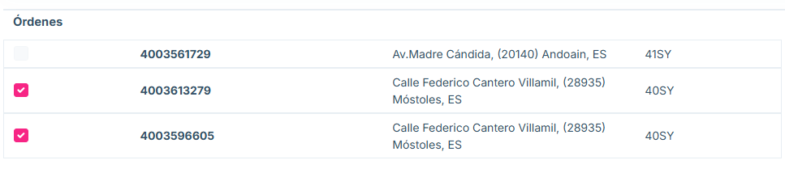
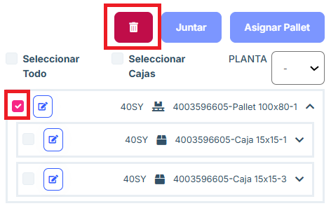
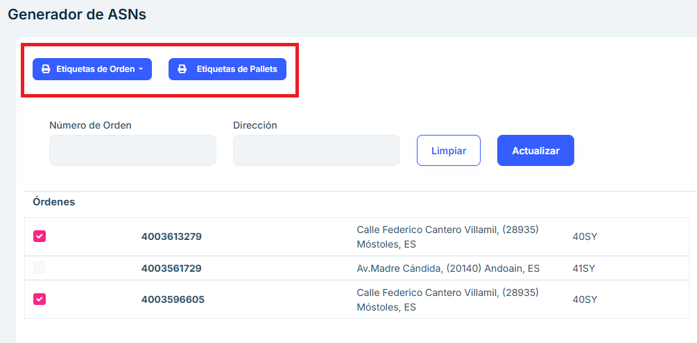

# Pending Shipment

**Overview**

The Pending Shipment section is designed to manage shipments that have not yet been completed. From this module, users can view pending orders, assign pallets to those orders, and generate labels and documents necessary for the logistics process. This section allows you to group boxes from different purchase orders on the same pallet, if necessary because that is how those orders have been packaged.

**Main features**

## Pending Shipment List

- A list is presented that includes key information about each pending shipment:

- Order Number: Unique identifier for the shipment.
- Date: Date of the order.
- Address: Shipment destination address.
- Number of Boxes: Total number of boxes associated with the shipment.
- Plant: Plant of the order destination (41SY, 40SZ...)

- This list allows you to select a specific shipment to perform additional actions.

If there are two or more orders with the same destination, they can be sent together, and the list of pallets and boxes of the orders together will be placed on the right side of the page.

## Pallet and box management

Section: Joining boxes from different purchase orders on a pallet

At any time, we can select boxes from the tree that go to the same floor and move them to a pallet using the “Assign Pallet” button.

This button will open a pallet creation window identical to the one explained in “Packing”. It is also possible to select boxes that are already on a pallet to move them to another one.

Section: Join pallets

If we want to send items from different purchase orders on the same pallet, we must proceed as follows:

In the window prior to “Pending shipment”: “Pack” or “Partial Shipments” we must pack said items in their own pallet and confirm them, in order to bring them to “Pending shipment”.

Once we can see said pallets in this window, we select them and click “Join”. This will create a single pallet that contains all the items from the pallets that have been joined together.

Section: Delete pallets

Pallets that contain boxes can be deleted. Deleting boxes or pallets that contain items is not allowed.

Section: Tree filters

In the tree you can:

Select All: will select both pallets and boxes that are not inside any pallet.

Select Boxes: will select the boxes that are not inside any pallet.

FLOOR: this is a drop-down menu that allows you to choose a floor from those available depending on which floors the packages in the tree are directed to. When you choose one, the “Select All” and “Select Boxes” buttons will only select packages that go to that floor.

Labels section:

We can get the first level labels by clicking “Order Labels” and then “Box Labels”. We can also get the pallet labels by clicking “Pallet Labels”.

Section: Send ASN

To send an ASN, you must select the packages in the tree that you want to include. After selecting them, the “ASN” button is pressed. This generates a Shipment and TKE is notified.

Any combination of first and second level boxes and pallets can be included in a shipment as long as they go to the same floor.

Packages that are not selected are not included in the ASN and remain on this “Pending Shipment” screen.

## Frequently asked questions

<b>Can a pallet or box be edited? </b>

Any pallet or box can be edited using the edit button and within the menu that appears. 

<b>How do you create an order ASN? </b>

In order for the application to allow the creation of the ASN, a tick must be placed on an order 
and the entire order must be on pallets. If part of the order is not on pallets, a tick will be placed 
on the boxes and the "Add Pallet" button will be pressed to create a pallet with them. 

