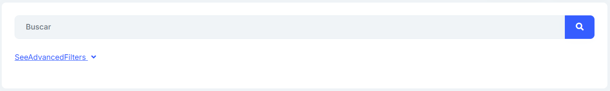
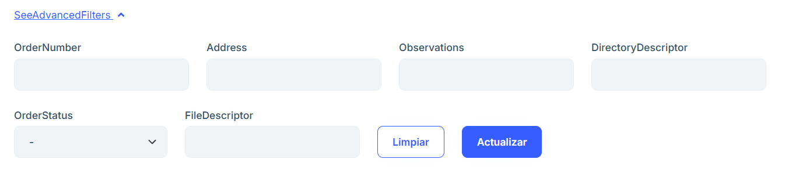
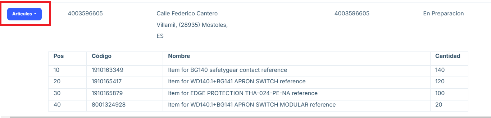

# Purchase Orders

**Overview**

The Purchase Orders section displays a list of the orders placed, providing the order number, the address to which it is sent, the date of the request, the directory number, the status of the order, as well as an options button to edit and delete an order.

**Main features**

## Search and filters

- Above the list there is a search engine that allows you to search for the text inserted in any of the sections.

- In the SeeAdvancedFilters section of the search engine, when you click on it, you will find a more specific filter for each of the attributes that make up each order.

## Items

By clicking the “Items” button we will be able to see a table with all the positions of the order.

