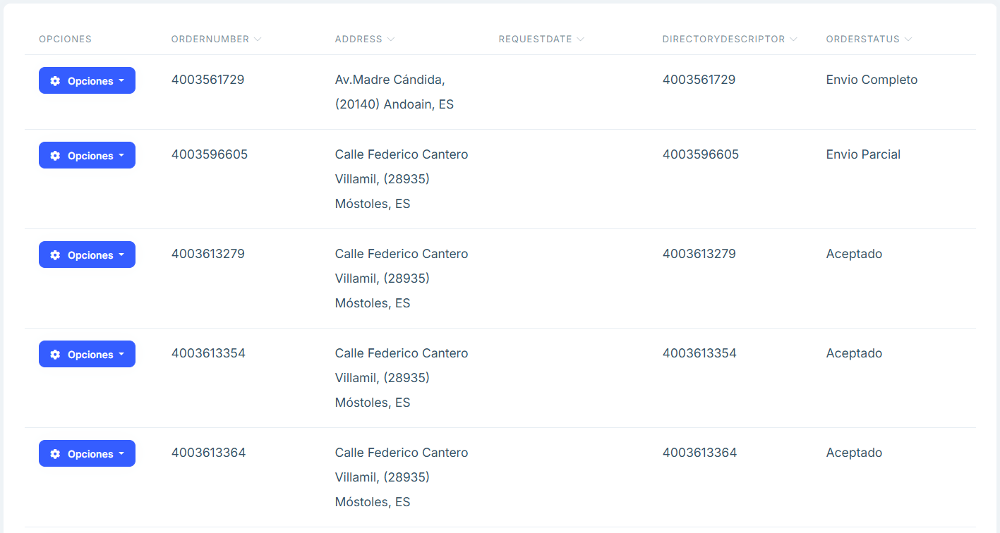

# Purchase Orders

**Overview**

The Purchase Orders section displays a list of the orders placed, providing the order number, the address to which it is sent, the date of the request, the directory number, the status of the order, as well as an options button to edit and delete an order.

**Main features**

## Search and filters

- Above the list there is a search engine that allows you to search for the text inserted in any of the sections.

- In the SeeAdvancedFilters section of the search engine, when you click on it, you will find a more specific filter for each of the attributes that make up each order.

## Items

By clicking the “Items” button we will be able to see a table with all the positions of the order.

## Frequently Asked Questions 

<b>How to filter or search for a specific order? </b>
There is a search and filtering of the different orders by each attribute that compose it at the top 
of the list. 

<b>Can you get an excel file of the list of orders? </b>
At the top of the page there is a button called 'ExporttoExcell' to create an Excel with the various 
orders shown in the list. 

<b>Can a new order be created? </b>
There is a button at the top of the page called "NewOrder" that allows you to create a new order 
via a menu and provide it with the necessary attributes. 

<b>How to edit or delete an order? </b>
The "Options" button allows you to edit and/or delete any of the existing orders. 

And when you click on "Edit" a menu is displayed that allows you to edit any of the order attributes.

