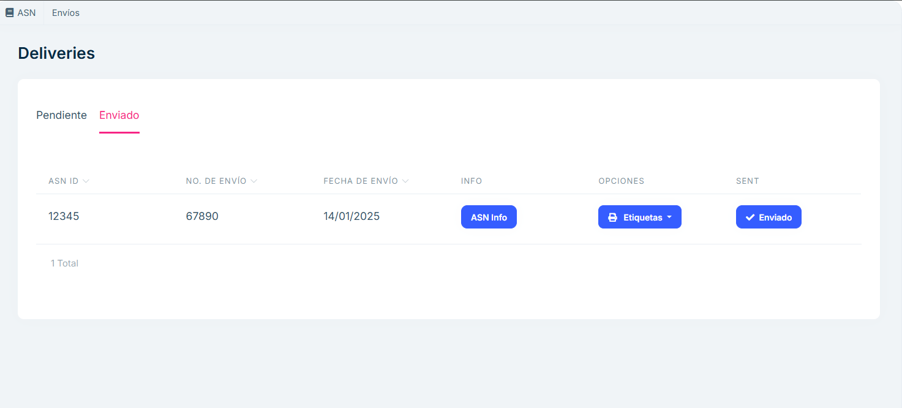

# Shipments

**Overview**

The Shipments section is designed to manage and monitor shipments within the system. It includes two main views: Pending and Shipped, allowing clear and structured control of the status of each shipment.

**Main features**

## Available Views

- Pending: Displays a list of shipments that have not yet been processed or shipped.

- Shipped: Displays a list of shipments that have already been managed and marked as shipped.

## Navigation between views

Users can switch between the Pending and Shipped tabs to view the items corresponding to each status.

## Pending

List of Pending Shipments:

- A list of shipments not yet processed is displayed.

Each row includes the following information:

- ID: Unique identifier for the shipment.
- Shipment Number: Shipment reference code or number.
- Action Buttons:

- Information: Provides additional details about the shipment. When clicked, a pop-up or modal box opens with relevant information.
- Labels: Generates and allows you to download labels for the corresponding shipment.
- Send: Changes the shipment status to "Sent" and automatically moves it to the Sent tab.
- Delete: Allows you to delete this shipment. TKE will be notified that the ASN needs to be deleted. All packages included in this shipment will appear again in "Pending Shipment".

## Sent

Sent Shipments List:

Similar to the Pending tab list, but shows only shipments that have already been processed and sent.

Each row includes:

- ID: ASN identifier.
- Shipment Number: Shipment code or reference number.
- Shipment date.
- Action buttons:
- Information: Provides additional details about the shipment. When clicked, a pop-up or modal box opens with relevant information.
- Labels: Generates and allows you to download labels (item, box, pallet, and packing slip) for the corresponding shipment.
- Shipped: Shipment status information.

This view acts as a record of completed shipments, allowing you to consult them at any time.

## Frequently asked questions

<b>What information is displayed in the Shipments section?</b>

The Shipments section has two main tabs:

Pending: Displays shipments that have not yet been processed, with the following information:
Shipment ID.
Shipment Number.
Action Buttons: Info, Labels, and Send .
Shipped: Displays shipments that have already been processed, with the same information fields.

<b>What actions can I perform from the "Pending" tab?</b>

From the Pending tab, you can:

View detailed shipment information by selecting the Info button.
Generate labels for items and boxes using the Labels button.
Mark a shipment as complete and move it to the Shipped tab using the Send button.

<b>How can I view a shipment that has already been processed?</b>

To view already processed shipments:

Go to the Shipped tab.
Find the shipment you need.
Select the shipment to view its information or generate labels again.

<b>What does the "Information" button do?</b>

The Information button displays ASN details for the selected shipment.

<b>What happens when I press the "Send" button in the Pending tab?</b>

When I press the Send button:

The status of the shipment changes from "Pending" to "Sent."
The shipment is automatically moved from the Pending tab to the Sent tab.
This change ensures a clear record of completed shipments.

<b>Can I generate labels for already completed shipments?</b>

Yes, from the Sent tab, you can generate labels again using the Labels button associated with each shipment.

<b>What is the difference between the "Pending" and "Sent" tabs?</b>

Pending: Contains shipments that have not yet been processed or completed. These can be managed with actions such as send and generate labels.

Sent: Contains shipments that have already been processed and marked as completed. Here you can only check the details or generate labels again.