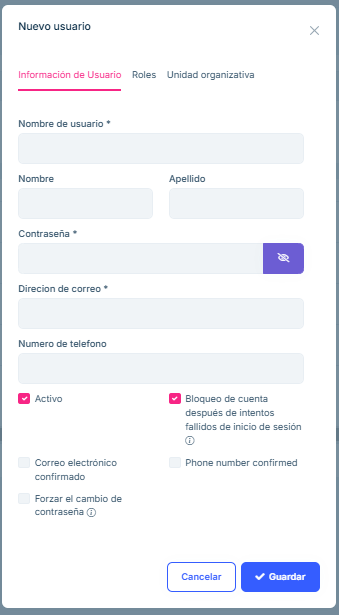

# User management

## User creation

To access the user management screen, in the menu we must press "Administration", "Identity management" and "Users".

Once inside, we can see a list of all existing users.

To create new users, we will press the "New User" button in the upper right corner.

This will open a form where we must enter the following data:

-  Username:

-  First and last name

-  Password

-  Email address

Additionally, we will have to grant the user the necessary permissions.
To do this, we will click on the "Roles" tab and select "admin".

Finally we click "Save"

## User editing

By clicking the "Actions" drop-down menu, a multitude of options about the user will be displayed.

We will mainly use "Edit" to modify user data and "Delete" to delete the user. 

