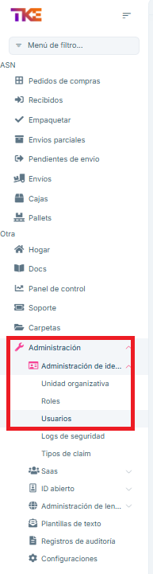
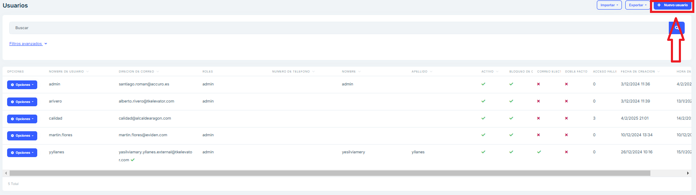
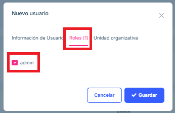
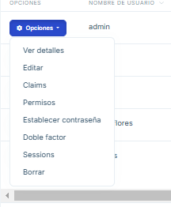

# Gestión de usuarios

## Creación de usuarios

Para acceder a la pantalla de gestiones de usuarios, en el menú debemos pulsar "Administración", "Administración de identidad" y "Usuarios".

Una vez dentro, podremos ver un listado de todos los usuarios existentes.

Para crear nuevos usuarios, pulsaremos el botón "Nuevo usuario" de la esquina superior derecha.

Esto abrirá un formulario donde debemos introducir los siguientes datos:

-   Nombre de usuario:

-   Nombre y apellido

-   Contraseña

-   Dirección de correo

Además, tendremos que otorgar al usuario los permisos necesarios.
Para ello, pulsaremos la pestaña "Roles" y seleccionaremos "admin".

Finalmente pulsamos "Guardar"

## Edición de usuarios

Al pulsar el desplegable "Acciones" se mostrarán multitud de opciones sobre el usuario.

Principalmente usaremos "Editar" para modificar datos del usuario y "Borrar" para eliminar el usuario. 

