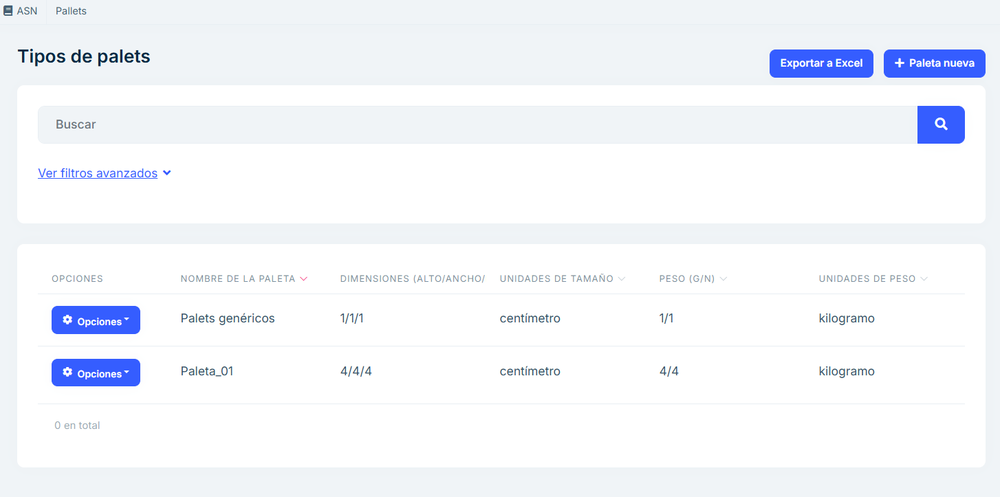
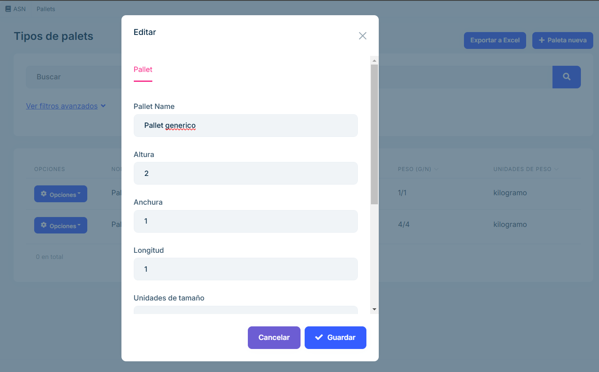

# Pallets

**General Description**

The "Pallets" window allows users to view, manage and organize the pallets registered 
in the system. This section is designed with advanced features for searching for specific 
pallets, editing, deleting and creating new pallets. Additionally, the option to export the 
data in Excel format is provided. 

**Main features**

## List of pallets

- A list is displayed with all the pallets registered in the system. 

- Each pallet includes relevant information about its characteristics, such as:

   - Name of the pallet. 
   - Dimensions (width, height, length). 
   - Units of size. 
   - Weight (G/N). 
   - Units of weight. 

   Management options. 

- Edit: Allows you to modify the characteristics of an existing pallet. Selecting this option opens 
an editable form with the current pallet data. 

- Delete: Provides the option to delete a palette from the system. This action requires confirma
tion to prevent accidental deletions.

## Advanced Filters 
Users can deploy the Advanced Filters panel to perform specific searches. This function
ality allows users to perform detailed searches by applying multiple selection criteria. 
This tool is designed to facilitate the location of specific pallets based on their character
istics. 

Search criteria include: 

   - Pallet code. 
   - Minimum height. 
   - Maximum height. 
   - Minimum width. 
   - Maximum width. 
   - Minimum length. 
   - Maximum length. 
   - Units of size. 
   - Minimum weight. 
   - Maximum weight. 
   - Units of weight. 
   - Orders. 
   - Box. 

## Procedure for use 

- Expand the Advanced Filters panel. 

- Set the desired criteria by entering specific values into the fields. 

- Press the Refresh button. When you click Refresh, the system processes the selected criteria 
and dynamically updates the list of pallets that meet those characteristics. Only pallets that 
match the applied filters are displayed, making analysis and management easier. 

## Create a new pallet 

- Option to add a new pallet to the system. 

- Clicking on this option opens a form in which the user can enter the data necessary to register 
a new pallet: 

   - Pallet name: Unique pallet ID that allows easy recognition in the system. For example: "Pallet 
   1", "Food Pallet", "Pallet Zone A". Facilitates the organization and tracking of pallets within 
   inventory and logistics. 

   - Height: The vertical measurement of the pallet, from its base to the top. Units: Specified in the 
   configured system, such as centimeters, inches, or meters. Example: 15 cm, 6 inches. Helps 
   calculate the space required for storage and transportation, especially when pallets are 
   stacked. 

   - Width: The horizontal measurement of the pallet at its shortest side. Units: Specified in cm, 
   inches, meters, etc. Example: 80 cm, 32 inches. This is critical to ensure the pallet fits properly 
   in storage racks or transport spaces. 

   - Length: The horizontal measurement of the pallet from front to back. It is measured in the 
   same units as the width and height. Example: 40 cm, 16 inches. Together with the width and 
   height, it determines the volume and space required for storage. 

   - Size Units: Specifies the measurement system used for pallet dimensions. Example: Centi
   meters (cm), inches (in), meters (m). Unifies measurements and prevents errors when mixing 
   different unit systems. 

   - Gross Weight: The total weight of the pallet, including its contents, packaging, and any additional materials. Units: Kilograms (kg), pounds (lb), etc. Example: 12 kg, 26 lb. This is critical for calculating transportation costs and complying with maximum weight regulations. 

   - Net weight: The weight of the pallet's contents, not including packaging. Units: Same unit as 
   gross weight (kg, lb, etc.). Example: 10 kg, 22 lb. Useful for determining the value of the con
   tents, especially in trade and inventories. 

   - Weight units: A system of measurement for weight (kilograms, pounds, etc.). Example: kg, lb. Ensures consistency in measurements and prevents errors in interpretation, especially in in
   ternational contexts. 

The form includes validations to ensure data integrity before saving. Together, these 
fields ensure that pallets can be properly identified, measured, weighed and trans
ported. They facilitate logistics, warehousing, inventory and trade by providing all 
the key information about the physical characteristics of each pallet. 

<b>The pallet needs to be created here so that it is recorded in the system and 
can be made available later in the packaging section, ensuring that the correct 
specifications are used in subsequent processes.</b>

## Export to Excel. 

- The Export to Excel option allows you to download an Excel file with the information on the 
list of pallets currently visible in the table. This feature is ideal for generating reports or per
forming external data analysis. 

- When you click the Export to Excel button, the system generates an Excel file containing the 
rows and columns currently visible in the palette listing. 

## Frequently Asked Questions

<b>What information is displayed in the pallet listing?</b>

The palette listing includes the following features: 

Pallet name. 
Dimensions: Width, length and height of the pallet. 
Size units. 
Weight. 
Weight units.

<b>How can I search for a specific pallet?</b>

Use the search engine or the Advanced Filters panel: 

Search: Enter keywords related to the pallet's characteristics, such as its code or pallet name. 

Advanced Filters: Allows you to perform detailed searches using criteria such as dimensions, order 
number, code, number of boxes. 

<b>How do advanced filters work?</b>

Advanced Filters allow you to fine-tune the palette listing based on specific criteria. To use them: 

Displays the advanced filters panel. Select the desired criteria (for example, dimensions or order 
number). Click the Update button to apply the filters and view the corresponding results. 

<b>Is it possible to export the list of palettes?</b>

Yes, you can export the current list to an Excel file: 

Refine the listing using the search box or advanced filters. Click the Export to Excel button. The 
file will automatically download to your browser's default folder, including only the records visible 
on the screen. 

<b>How can I register a new pallet?</b>

To add a new palette to the system: 

Click the New Pallet button. Fill in the form with the necessary data, such as pallet name and 
dimensions. Save the data to register the pallet. 

<b>What happens if I try to register a pallet with incorrect data?</b>

The form includes validations that prevent incorrect or incomplete data from being saved. If there 
are errors, the system will display messages indicating which fields need to be corrected before 
saving. 

<b>How can I correct an error in the data of an already registered palette?</b>

To correct a pallet's data: 

Locate the pallet in the list. 

Click the Options button associated with that pallet. Two options will be displayed: Edit and 
Delete. Press the Edit option if you want to modify changes to the selected pallet, make the 
necessary changes in the form and save the updated data. Or, press Delete if you want to 
delete the entire selected pallet.