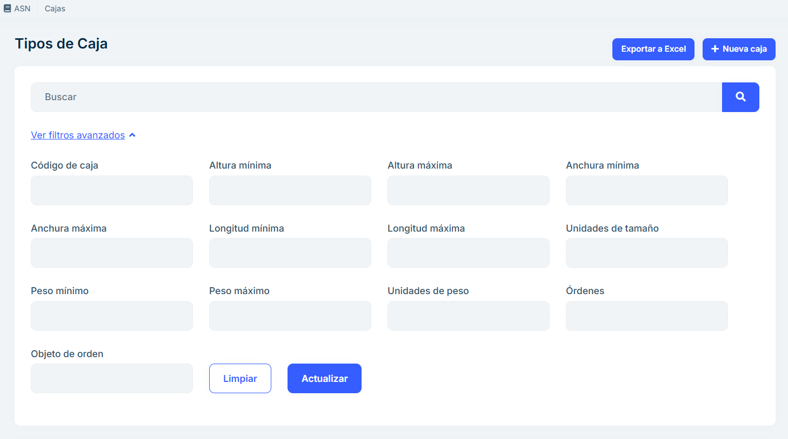
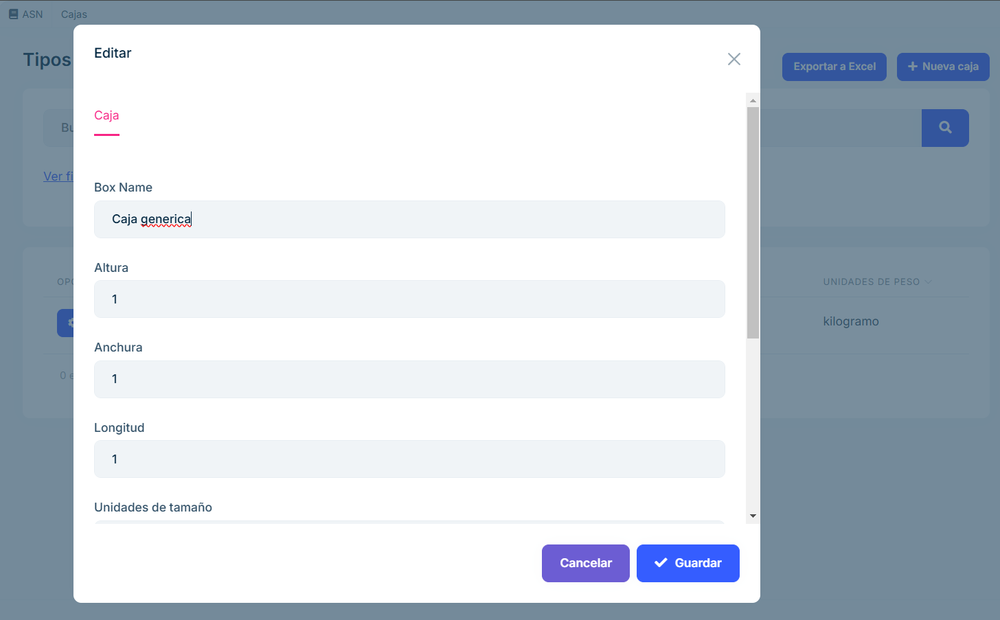
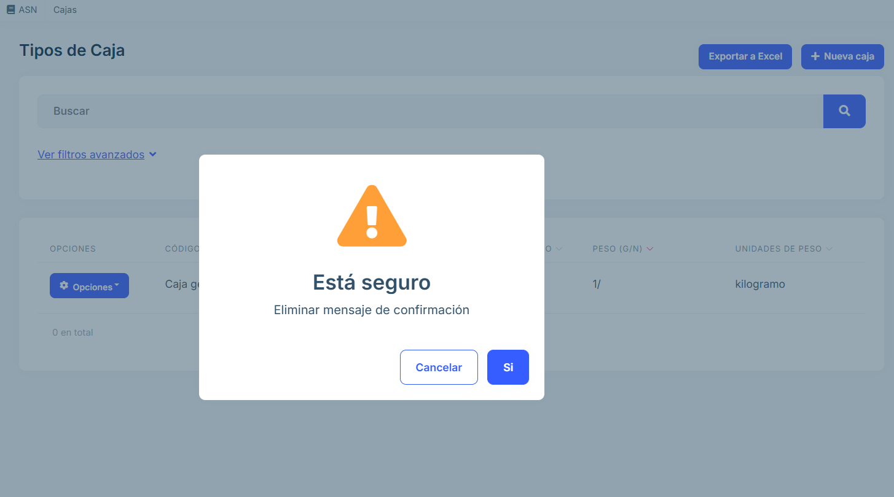

# 2.2.2 Cajas

**2.2.2.1 Descripción general**

El apartado Cajas permite gestionar todas las cajas registradas en el sistema. Los usuarios pueden buscar, filtrar, editar, eliminar, exportar y crear nuevas cajas de manera intuitiva. Este módulo está diseñado para garantizar una administración eficiente de las cajas y sus características.

**2.2.2.2 Funcionalidades principales.**

#### 2.2.2.2.1 Buscador

El campo de búsqueda permite localizar cajas rápidamente introduciendo texto relacionado con sus características principales, como el nombre, tipo de caja o cualquier otro dato relevante.

#### 2.2.2.2.2 Filtros Avanzados

El desplegable de Filtros Avanzados permite realizar búsquedas más específicas aplicando diferentes criterios.

Los criterios disponibles incluyen:

- Código de caja.
- Altura mínima.
- Altura máxima.
- Anchura mínima.
- Anchura máxima.
- Longitud mínima.
- Longitud máxima.
- Unidades de tamaño.
- Peso mínimo.
- Peso máximo.
- Unidades de peso.
- Órdenes.
- Objeto de orden.

Una vez configurados los filtros, los usuarios pueden presionar el botón Actualizar dentro del panel para que el listado de cajas se actualice automáticamente, mostrando solo los resultados que cumplan con los criterios seleccionados.

#### 2.2.2.2.3 Listado de Cajas

- Se muestra una tabla con todas las cajas existentes en el sistema.

- Cada fila del listado representa una caja e incluye información como:
   
    - Código de caja.
    - Dimensiones (alto/ancho/largo).
    - Unidades de tamaño.
    - Peso (G/N).
    - Unidades de peso.

- Cada caja tiene dos botones de acción asociados:

Editar: Abra un formulario para modificar las características de la caja seleccionada.

Borrar: Permite borrar la caja del sistema tras confirmar la acción.

#### 2.2.2.2.4 Exportar a Excel.

- Al hacer clic en el botón Exportar a Excel, se descargará automáticamente un archivo Excel con la información de las cajas mostradas en el listado.

- El archivo descargado se guarda en la carpeta de descargas predeterminada del navegador.

#### 2.2.2.2.5 Crear Nueva Caja

- Este botón permite registrar una nueva caja en el sistema.

- Al seleccionarlo, se despliega un formulario en el que los usuarios deben ingresar la información requerida:

    * nombre de la caja: Un nombre identificativo que permita reconocer fácilmente la caja. Ejemplo: "Caja Grande #1", "Caja Electrónicos". Ayuda a organizar y localizar rápidamente la caja en un sistema de inventario o gestión. 

    * anchura: La medida horizontal de la caja cuando se mira desde el frente. Las unidades Pueden especificarse en centímetros, pulgadas, metros u otras unidades dependiendo de la configuración. Por ejemplo: 30 cm, 12 pulgadas. Es clave para determinar el espacio que ocupará la caja, especialmente en almacenamiento o transporte. 

    * altura: La medida vertical de la caja desde la base hasta la parte superior. Las unidades de medida son similares a la anchura, se especifica en cm, pulgadas, etc. Este dato es necesario para calcular el volumen total de la caja y para verificar su adecuación en espacios con restricciones de altura. 

    * longitud: La medida horizontal de la caja desde el frente hasta el fondo. Se mide en las mismas unidades que la anchura y la altura. Ejemplo: 40 cm, 16 pulgadas. Junto con la anchura y la altura, determina el volumen y espacio necesario para almacenamiento. 

    * unidades de tamaño: Especifica el sistema de medidas usado para las dimensiones de la caja. Ejemplo: Centímetros (cm), pulgadas (in), metros (m). Unifica las mediciones y evita errores al mezclar sistemas de unidades diferentes. 

    * peso bruto: El peso total de la caja, incluyendo su contenido, embalaje y cualquier otro material adicional. Unidades: Kilogramos (kg), libras (lb), etc. Ejemplo: 12 kg, 26 lb. Es fundamental para calcular costos de transporte y cumplir con las regulaciones de peso máximo. 

    * peso neto: Es el peso del contenido de la caja sin incluir el embalaje. Unidades: Misma unidad que el peso bruto (kg, lb, etc.). Ejemplo: 10 kg, 22 lb. Es útil para determinar el valor del contenido, especialmente en comercio e inventarios. 

    * unidades de peso: Sistema de medida para el peso (kilogramos, libras, etc.). Ejemplo: kg, lb. Asegura coherencia en las mediciones y evita errores de interpretación, especialmente en contextos internacionales. 

- El formulario incluye validaciones para garantizar la integridad de los datos antes de guardarlos.

    Estos campos juntos garantizan que las cajas puedan ser identificadas, medidas, pesadas y transportadas adecuadamente. Facilitan la logística, almacenamiento, inventario y comercio al proporcionar toda la información clave sobre las características físicas de cada caja. 

    <b>Es necesario crear aquí la caja para que esta quede registrada en el sistema y pueda estar disponible posteriormente en la sección de empaquetado, asegurando que se utilicen las especificaciones correctas en los procesos posteriores.</b>

#### 2.2.2.2.6 Preguntas frecuentes

<b>¿Qué información se muestra en el listado de cajas?</b>

El listado de cajas muestra información clave para cada caja registrada, incluyendo:

- Código único de la caja.
- Dimensiones (ancho, largo, alto).
- Unidades de tamaño.
- Peso.
- Unidades de peso.

<b>¿Cómo puedo buscar una caja específica?</b>

Puedes buscar una caja específica utilizando el campo de búsqueda. Introduzca cualquiera de los siguientes datos:

- Código de caja.
- Número de orden.
- Dimensiones o cualquier otra característica relevante.

<b>¿Cómo puedo editar o eliminar una caja?</b>

Cada caja en el listado incluye dos botones:

Editar: Permite modificar las características de la caja. Al hacer clic, se abre un formulario editable.

Eliminar: Borra la caja del sistema. Esta acción requiere confirmación para evitar eliminaciones accidentales.

<b>¿Cómo puedo registrar una nueva caja?</b>

Para crear una nueva caja:

Haz clic en el botón Crear Nueva Caja.
Complete el formulario con los datos necesarios (dimensiones, material, estado, etc.).
Guarda los cambios para registrar la caja en el sistema.

<b>¿Qué sucede si intento guardar una caja con datos incorrectos?</b>

El formulario de creación y edición incluye validaciones que aseguran la integridad de los datos. Si ingresa información incorrecta o faltan campos obligatorios, el sistema mostrará un mensaje de error indicando los ajustes necesarios antes de guardar.

<b>¿Qué hacer si no encuentro una caja que debería estar registrada?</b>

Si no encuentras una caja: 

Verifique que no se hayan aplicado filtros que puedan estar ocultándola. 
Intenta buscarla por su identificador o código único u otra característica distintiva. 
Si la caja sigue sin aparecer, confirme con el administrador del sistema si ha sido eliminada o archivada.

<b>¿Cómo crear un documento Excel?</b>

Haz clic en el botón superior derecho Exportar a Excel. Se descargará automáticamente un archivo Excel con la información de las cajas mostradas en el listado.

