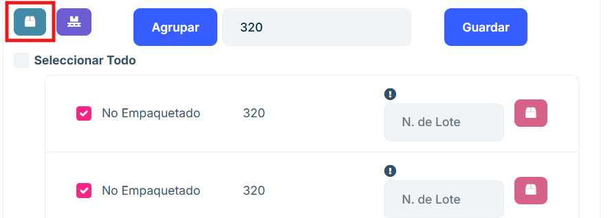
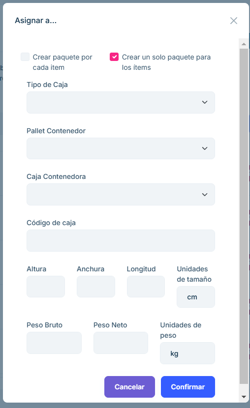
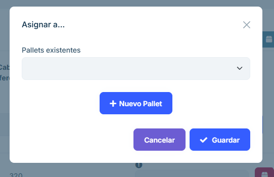
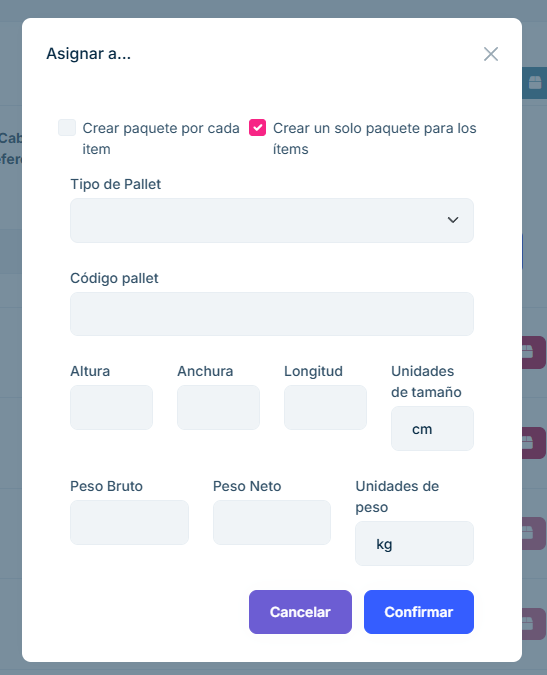
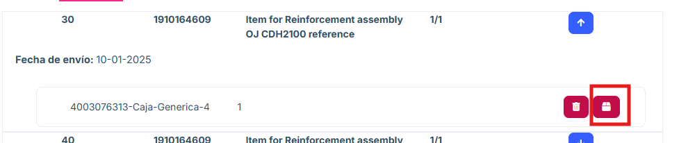
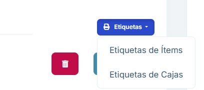
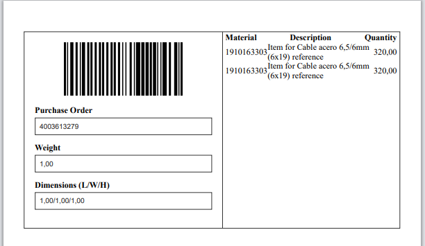
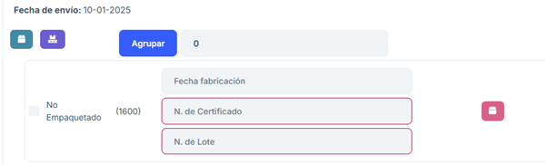

# 2.2.5 Empaquetar

**Descripción general**

En el apartado "Empaquetar" tenemos acceso a las órdenes que han sido previamente confirmadas en el sistema de Jaggaer, han sido recibidas por el sistema de ASN 2.0 y están listas para comenzar el proceso de empaquetado.  

En este apartado, sólo se pueden elegir órdenes individualmente. Si queremos juntar cajas de distintas órdenes, se podrá hacer más adelante en el aplicativo.   

En el apartado de Empaquetar se visualiza un listado los paquetes realizados proporcionando el número de pedido, la dirección y la planta a la que se envía, el número de cajas que han sido empaquetadas, los pallets y un botón de opciones "Delivery Notes". 

**Funcionalidades principales**

## Buscador

- Permite realizar búsquedas en el listado por los atributos de número de orden y dirección de envío.

## Nota de envío

- Al pulsar el botón "Delivery Notes" en cualquiera de los paquetes se visualiza la página de Nota de envío en la que se puede ver el paquete que está pendiente de empaquetar o ya empaquetado. 

- La posición de la orden (en este caso el 10)  

- La planta de la orden (en este caso 40SY) 

- El número del ítem (en este caso es 1910163349)  

- El nombre del ítem (Item for BG140 safetygear contact reference)  

- El número de ítems a empaquetar (0/140)  

- Fecha de envío. 

## Pendiente

- En caso de que el paquete esté como pendiente permite desplegar un menú en el que se puede elegir el número de pallets y de cajas que se quiere empaquetar, agrupando el número de items que se desean hasta conseguir el total descrito de los items a enviar.

- Se debe colocar el número de items por caja o pallet y la propia aplicación proporciona un listado con los grupos de items. Se puede proponer un número de lote identificador del paquete.

## Cajas

- Se puede escoger si se desean crear cajas con los elementos.

- Aparece un menú que permite insertar los items elegidos en una caja existente buscada en el buscador o crear una nueva caja e insertar en ella los items escogidos.

- En caso de no colocar el número de grupos para empaquetar aparece el menú para empaquetar con el número total de los lotes a empaquetar.

- Para crear una caja se realiza pulsando "+ Nueva caja" y aparece este menú. Se puede asignar a una caja a cada item o asignar una caja a todos los items mediante el tick de encima del menú.

## Pallets

- Para empaquetar los items en pallets será necesario elegir los lotes del listado que se desean y presionar el botón para agruparlos en pallets.

- De la misma manera que las cajas al convertirlos en pallets aparece un menú aue permite meterlos en un pallet ya existente o crear un nuevo pallet para almacenarlos ahí.

- Para crear un pallet se realiza pulsando "+ Nuevo pallet" y aparece este menú. Se puede asignar a un pallet a cada ítem o asignar un pallet a todos los ítems mediante el tick de encima del menú.

## Empaquetar una posición

- Se permite seleccionar una posición completa, o varias, y empaquetarla en su totalidad utilizando los botones de pallet y caja a la derecha. Para seleccionarla, debemos usar el check que tiene la posición a la izquierda. Esta opción sólo está disponible para posiciones en las cuales no se ha generado ninguna subdivisión de ítems. Con la opción "Seleccionar todo" seleccionaremos todas las posiciones que se puedan seleccionar para empaquetar de esta manera.

## Empaquetado

- En el momento en el que se meten en cajas o pallets todos los items del apartado "Pendientes" aparecen en este listado, proporcionando la posibilidad de desempaquetar los los items del listado.

  Se puede desempaquetar cualquiera de los ítems mediante el siguiente icono. 

## Listado de paquetes

- A la derecha de la página se encuentra el listado de las cajas y pallets creados para el envío. Se permite editar los datos del propio pallet o caja y visualizar los items que los componen.

- Al seleccionar uno de los elementos de este listado permite eliminarlos y en caso de ser cajas permite meterlas en una caja o en un pallet.

<b>En caso de confirmar el pedido pero no acabar de empaquetar todo el listado de items el listado de los items pendientes aparecerán en el listado de la sección "Envíos parciales" del aplicativo. </b>

Mediante el botón "Etiquetas" se puede sacar un pdf de los items y las cajas existentes.

## Empaquetado a un solo nivel 

- Sobre una misma posición se puede empaquetar de diferentes maneras:  

- Cuando aplicas al checkbox utilizando los botones de caja o pallet de la derecha podríamos empaquetar la posición completa. 

- Si se quieren empaquetar más de una posición al mismo tiempo podremos marcar con el checkbox tantas posiciones como deseemos.  

##  Emapaquetado a dos niveles

- Los paquetes que se crean aparecerán en un árbol en la parte derecha de la pantalla. Con estos paquetes si clicamos el lapicer nos aparecerá un formulario para editarlos.  

- Al seleccionar varios paquetes podremos pulsar el botón caja/pallet e introducir los paquetes seleccionados dentro de un segundo paquete. Por regla general esto se realizará pulsando el botón pallet para paletizar cajas.  

- En cualquier momento podremos seleccionar tantos pallets y cajas como queramos y eliminarlos pulsando el botón con la papelera. Si eliminamos un paquete con items dentro, estos quedan desempaquetados.

- Si lo que borramos es un paquete con paquetes dentro, los paquetes hijos no serán eliminados.

- En esta pantalla podremos sacar las etiquetas de primer nivel, pulsando en “Etiquetas” y después en “Etiquetas de Caja”. 
Con este botón sacaremos las etiquetas de Cajas y Pallets que contengan items. 

- Encima de la lista de posiciones vemos las pestañas pendiente y empaquetado. En “Pendiente” aparecen aquellas posiciones que aún no han sido totalmente empaquetadas. En “Empaquetado” aquellos que sí han sido empaquetadas en su totalidad. 

- Para pasar lo que s eha empaquetado a la pestaña “Pendiente de Envío”, se debe pulsar el botón “Confirmar”.  

- Esto moverá el empaquetamiento que hayamos realizado al siguiente apartado. No será posible retroceder de vuelta a la ventana de “Empaquetamiento” aquellas cajas y pallets que se confirmen. 

## Empaquetado con número de lote 

Se deberá agrupar los ítems y en cada grupo se deberá introducir de forma manual el número de lote, el número del certificado y la fecha de fabricación. En caso de que falte por colocar el número de lote o de certificado no se permitirá confirmar el pedido, se puede completar en la sección de “Empaquetado” y así poder confirmar el pedido.  

Colocando un número de certificado o de lote con el formato incorrecto aparecerá 	un mensaje aconsejando su formato correcto: 

En caso de que el formato sea correcto se verá de esta manera: 

## Empaquetado con muchas posiciones 

En este caso se puede coger todos los elementos y empaquetar a cada uno en un a caja. En caso de necesitar número de lote no permitirá el empaquetado de esta manera si no se coloca manualmente. 

Desde el listado de empaquetados se puede ir agregando en pallets. Se puede sacar las etiquetas de los envíos. 

## Empaquetado con número de serie 

Cuando en la orden haya posiciones que requeiran número de serie, aparecerá un botón encima de la lista de posiciones que permite introducir grandes cantidades de números de serie en poco tiempo. 

Cuando se pulsa el botón, se abre una ventana que nos permite elegir para qué tipo de item queremos introducir números de serie. 

Al elegir un item, aparecerá un campo de texto donde introducir los números de serie. 

Pueden ir separados por salto de línes o por punto y coma (“;”). 
Será necesario introducir la totalidad de números de serie que se requieren, encima del campo de texto podemos ver cuántos números de serie llevamos introducidos y cuál es el total necesario. 

Tras pulsar “Guardar” si ha habido algún problema el aplicativo nos avisará. Si todo ha ido bien, los números de serie del tipo de ítem elegido habrán sido guardados. 

## Formulario de caja/pallet

- Una vez pulsemos el botón de caja o pallet se desplegará este recuadro en el que podremos decidir si queremos introducir los ítems en una caja previamente creada en esta orden o si preferimos crear una nueva caja pulsando el botón “+ Nueva caja/pallet” 

- Si pulsamos nueva caja/pallet nos aparecerá este formulario de creación de caja o pallet (según el botón pulsado). En este formulario al elegir un tipo de caja/pallet estaremos seleccionando uno de los tipos genéricos previamente creados. Los campos se autocompletarán con la información de la caja/pallet previamente creado, aun asi cualquier campo es modificable. 

- Arriba en el formulario aparecen dos checkbox para poder seleccionar si queremos crear un solo bulto para todas las posiciones seleccionadas o si crearemos un bulto para cada posición.  

- Si deseamos crear distintos paquetes para una misma posición podemos usar la opción “Agrupar”. Se crearán paquetes en función el numero que indiquemos una vez pulsemos el botón “Agrupar” 

- Los subpaquetes que han sido creados tras pulsar la opción “Agrupar” se pueden empaquetar usando los botones caja o pallet que aparecen al desplegar la posición. 

- Una vez un item está empaquetado podremos o bien desempaquetarlo pulsando el botón de la caja o eliminarlo pulsando el botón de la papelera.  

- Si pulsamos los botones de caja o pallet que están dentro de la posición sin seleccionar ningún subpaquete generado tras agrupar podremos indicar la cantidad que deseamos para el nuevo paquete que vamos a crear.  

## Preguntas frecuentes

<b>¿Cómo buscar una orden?</b>
En la parte superior de la página existe un buscador que permite hacer una búsuqeda por cualquiera de sus atributos principales.

<b>¿Cómo dejar en la sección de empaquetados un paquete pendiente?</b>
Cada item posee un listado de los productos a empaquetar, se deberá agrupar en un grupo de ellos y se debe elegir los productos para meterlos en cajas o en pallets dependiendo de los que se desee.

Eso hará que se muestre en el listado de la derecha de la página y en la sección de empaquetados, listo para confirmar.

<b>¿Por qué al sacar una etiqueta luego no funciona la web?</b>
En caso de sacar una etiqueta, para seguir trabajando en la web se deberá cancelar la etiqueta.

