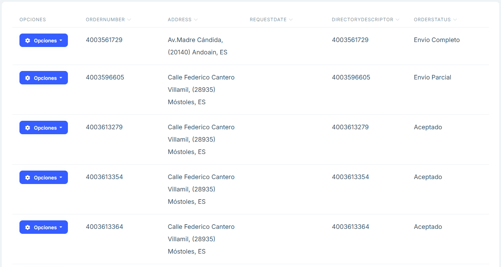

# Pedidos de compra

**Descripción general**

En el apartado de Pedidos de compra se visualiza un listado de los pedidos realizados proporcionando el número de pedido, la dirección a la que se envía, la fecha de la solicitud, el número de directorio, el estado del pedido, además de un botón de opciones para editar y eliminar un pedido.

**Funcionalidades principales**

## Buscador y filtros

- Encima del listado se encuentra un buscador que permite buscar el texto insertado en cualquiera de los apartados.

- En la sección SeeAdvancedFilters del buscador, al pulsarlo, se encuentra un filtrado más en particular para cada uno de los atributos que componen cada pedido.

## Artículos

Al pulsar el botón “Artículos” podremos ver una tabla con todas las posiciones de la orden. 

