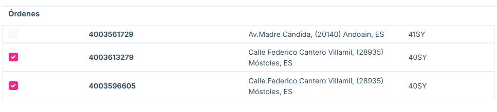
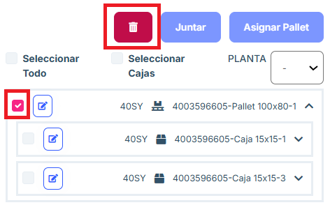
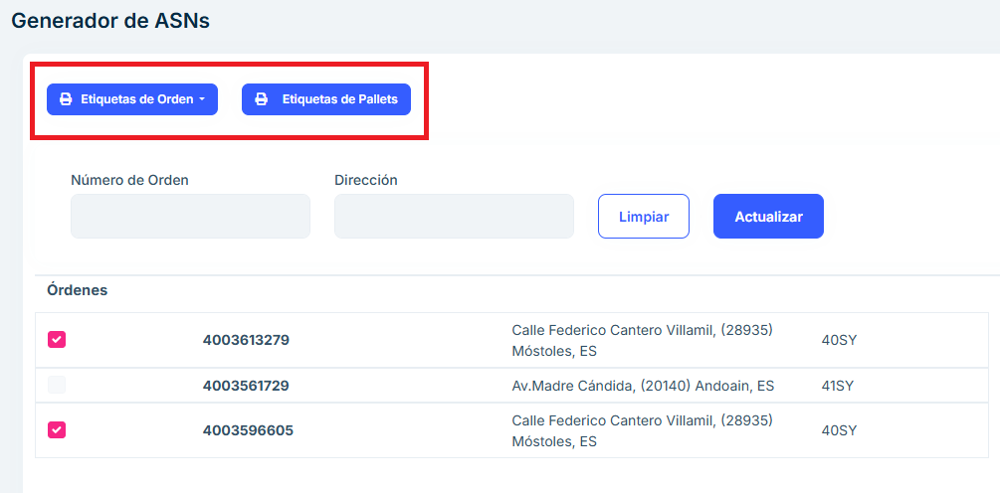
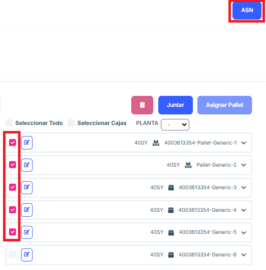

# Pendientes de envío

**Descripción general**

El apartado Pendientes de Envío está diseñado para gestionar los envíos que aún no han sido completados. Desde este módulo, los usuarios pueden consultar los pedidos pendientes, asignar pallets a dichos pedidos y generar etiquetas y documentos necesarios para el proceso logístico. Este apartado permite juntar cajas de distintos pedidos de compra en un mismo pallet, si así se necesita porque así se han empaquetado dichos pedidos. 

**Funcionalidades principales**

## Listado de Envíos Pendientes

- Se presenta un listado que incluye información clave de cada envío pendiente:

   - Número de Orden: Identificador único del envío.
   - Fecha: Fecha del pedido.
   - Dirección: Dirección de destino del envío.
   - Número de Cajas: Total de cajas asociadas al envío.
   - Planta: Planta del destino del pedido (41SY, 40SZ...)

- Este listado permite seleccionar un envío específico para realizar acciones adicionales.

  En caso de existir una dos o más ordenes con el mismo destino se podrán mandar en conjunto, y se colocará a la derecha de la página el listado con los pallets y las cajas de las ordenes juntas.

## Gestión de pallets y cajas

Seccion: Juntar cajas de diferentes pedidos de compra en un pallet 

En todo momento podremos seleccionar cajas del árbol que vayan a una misma planta y moverlas a un pallet utilizando el botón “Asignar Pallet”. 

Este botón abrirá una ventana de creación d epallet idéntica a la explicada en “Empaquetar”. También se permite seleccionar cajas que ya están dentro de un pallet para moverlas a otro. 

Seccion: Juntar pallets 

Si se diese el caso de que queremos enviar items de distintos pedidos de compra sobre un mismo pallet, se debe proceder de la siguiente manera: 

En la ventana previa a “Pendiente de envío”: “Empaquetar” o “Envios Parciales” debemos empaquetar dichos item en su propio pallet y confirmarlos, para poder traerlos a “Pendiente de Envio”. 
Una vez podamos visualizar dichos pallets en esta ventana, los seleccionamos y pulsamos “Juntar”. Esto creará un sólo pallet que contenga todos los items de los pallets que han sido juntados. 

Seccion: Eliminar pallets 

Se podrán eliminar pallets que contengan cajas. No se permite eliminar Cajas ni Pallets que contengan items. 

Seccion: Filtros del árbol 

En el árbol se permite: 

 Seleccionar Todo: seleccionará tanto pallets como cajas que no estén dentro de ningún pallet. 

Seleccionar Cajas: seleccionará las cajas que no estén dentro de ningún pallet. 

PLANTA: se trata de un desplegable que permite elegir una planta de las disponibles según a qué plantas van dirigidos los paquetes que hay en el árbol. Al elegir una, los botones “Seleccionar Todo” y “Seleccionar Cajas” sólo seleccionarán paquetes que vayan a esa planta. 

Sección etiquetas: 

Podremos sacar las etiquetas de primer nivel pulsando “Etiquetas de Orden” y después “Etiquetas de Cajas”. También podremos sacar las etiquetas de pallets pulsando “Etiquetas de Pallets”. 

Seccion: Enviar ASN 

Para enviar un ASN, se debe seleccionar los paquetes del árbol que se desean incluir. Tras haberlos seleccionado, se pulsa el botón “ASN”. Esto genera un Envío y se notifica a TKE. 

En un envío se permite incluir cualquier combinación de cajas y pallets de primer y segundo nivel mientras vayan a la misma planta. 

Los paquetes que no se seleccionen no se incluyen en el ASN y permanecen en esta pantalla de “Pendiente de Envío”. 

## Preguntas frecuentes

<b>¿Se puede editar un pallet o caja?</b>
Se puede editar cualquier pallet o caja en el botón de edición y dentro del menú que aparece.

<b>¿Cómo se crea el ASN de una orden?</b>
Para que la aplicación permita crear el ASN se debe poner tick en una orden y es necesario que esta esté en pallets todo el pedido. En caso de no estar parte del pedido en pallets, se colocará un tick de las cajas y se pulsará el botón "Agregar Pallet" para crear un pallet con estas. 

