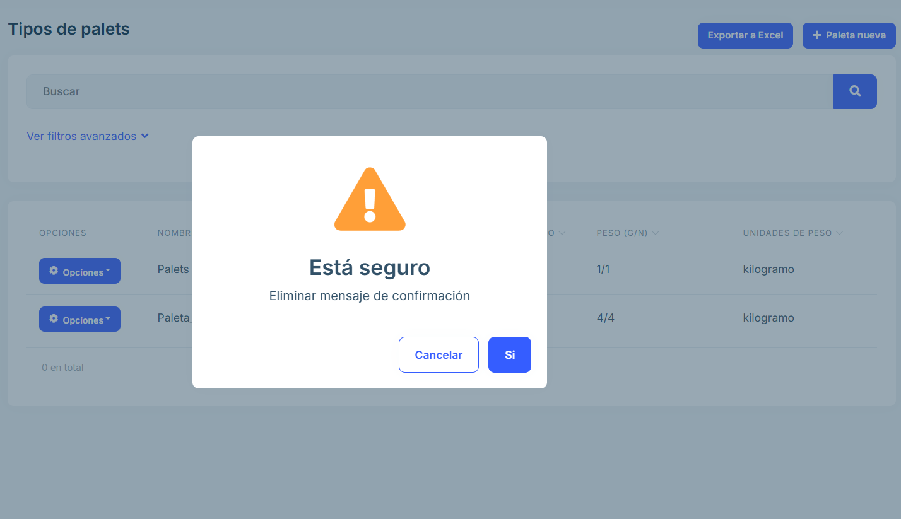
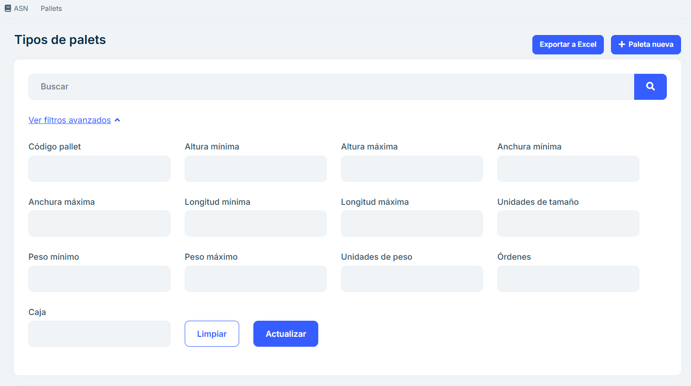
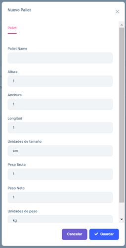

# Pallets

**Descripción General**

La ventana "Pallets" permite a los usuarios visualizar, gestionar y organizar los pallets registrados en el sistema. Este apartado está diseñado con funcionalidades avanzadas para la búsqueda de pallets concretos, edición, eliminación y creación de nuevos pallets. Adicionalmente, se proporciona la opción de exportar los datos en formato Excel.

**Funcionalidades principales**

## Listado de pallets

- Se muestra un listado con todos los pallets registrados en el sistema.
- Cada pallet incluye información relevante sobre sus características, tales como:
   - Nombre del pallet.
   - Dimensiones (ancho, alto, largo).
   - Unidades de tamaño.
   - Peso (G/N).
   - Unidades de peso.

   Opciones de gestión

- Editar: Permite modificar las características de una paleta existente. Al seleccionar esta opción, se abre un formulario editable con los datos actuales del pallet.

- Borrar: Proporciona la opción de borrar una paleta del sistema. Esta acción requiere confirmación para evitar eliminaciones accidentales.

## Filtros Avanzados

Los usuarios pueden desplegar el panel de Filtros Avanzados para realizar búsquedas específicas. Esta funcionalidad permite a los usuarios realizar búsquedas detalladas aplicando múltiples criterios de selección. Esta herramienta está diseñada para facilitar la localización de pallets específicos en función de sus características.

Los criterios de búsqueda incluyen:

   - Código pallet.
   - Altura mínima.
   - Altura máxima.
   - Anchura mínima.
   - Anchura máxima.
   - Longitud mínima.
   - Longitud máxima.
   - Unidades de tamaño.
   - Peso mínimo.
   - Peso máximo.
   - Unidades de peso.
   - Órdenes.
   - Caja.

## Procedimiento de uso:

- Desplegar el panel de Filtros Avanzados.

- Configurar los criterios deseados ingresando valores específicos en los campos.

- Presionar el botón Actualizar. Al hacer clic en Actualizar, el sistema procesa los criterios seleccionados y actualiza dinámicamente el listado de pallets que cumplen con dichas características.
Solo se muestran los pallets que coinciden con los filtros aplicados, facilitando el análisis y la gestión.

## Crear un nuevo pallet

- Opción para agregar un nuevo pallet al sistema.

- Al hacer clic en esta opción, se abre un formulario en el que el usuario puede ingresar los datos necesarios para registrar un nuevo pallet: 

   - Nombre del pallet: Identificación única del pallet que permita reconocerlo fácilmente en el sistema. Por ejemplo: "Pallet 1", "Pallet de alimentos", "Pallet Zona A". Facilita la organización y el seguimiento de los pallets dentro del inventario y logística. 

   - Altura: La medida vertical del pallet, desde su base hasta la parte superior. Las unidades: Especificada en el sistema configurado, como centímetros, pulgadas o metros. Ejemplo: 15 cm, 6 pulgadas. Ayuda a calcular el espacio requerido en almacenamiento y transporte, especialmente cuando los pallets se apilan. 

   - Anchura: La medida horizontal del pallet en su lado más corto. Unidades: Especificada en cm, pulgadas, metros, etc. Ejemplo: 80 cm, 32 pulgadas. Es fundamental para garantizar que el pallet se ajuste correctamente en racks de almacenamiento o espacios de transporte. 

   - Longitud: La medida horizontal del pallet desde el frente hasta el fondo. Se mide en las mismas unidades que la anchura y la altura. Ejemplo: 40 cm, 16 pulgadas. Junto con la anchura y la altura, determina el volumen y espacio necesario para almacenamiento. 

   - Unidades de tamaño: Especifica el sistema de medidas usado para las dimensiones del pallet. Ejemplo: Centímetros (cm), pulgadas (in), metros (m). Unifica las mediciones y evita errores al mezclar sistemas de unidades diferentes. 

   - Peso bruto: El peso total del pallet, incluyendo su contenido, embalaje y cualquier otro material adicional. Unidades: Kilogramos (kg), libras (lb), etc. Ejemplo: 12 kg, 26 lb. Es fundamental para calcular costos de transporte y cumplir con las regulaciones de peso máximo. 

   - Peso neto: Es el peso del contenido del pallet sin incluir el embalaje. Unidades: Misma unidad que el peso bruto (kg, lb, etc.). Ejemplo: 10 kg, 22 lb. Es útil para determinar el valor del contenido, especialmente en comercio e inventarios. 

   - Unidades de peso: Sistema de medida para el peso (kilogramos, libras, etc.). Ejemplo: kg, lb. Asegura coherencia en las mediciones y evita errores de interpretación, especialmente en contextos internacionales. 

El formulario incluye validaciones para garantizar la integridad de los datos antes de guardarlos. Estos campos juntos garantizan que los pallets puedan ser identificados, medidos, pesados y transportados adecuadamente. Facilitan la logística, almacenamiento, inventario y comercio al proporcionar toda la información clave sobre las características físicas de cada pallet. 

<b>Es necesario crear aquí el pallet para que este quede registrado en el sistema y pueda estar disponible posteriormente en la sección de empaquetado, asegurando que se utilicen las especificaciones correctas en los procesos posteriores.</b>

## Exportar a Excel.

- La opción de Exportar a Excel permite descargar un archivo en formato Excel con la información del listado de pallets actualmente visibles en la tabla. Esta funcionalidad es ideal para generar informes o realizar análisis externos de los datos. 

- Al hacer clic en el botón Exportar a Excel, el sistema genera un archivo Excel que contiene las filas y columnas actualmente visibles en el listado de paletas.

## Preguntas frecuentes

<b>¿Qué información se muestra en el listado de paletas?</b>

El listado de paletas incluye las siguientes características:

Nombre del pallet.
Dimensiones: Ancho, largo y alto del pallet.
Unidades de tamaño.
Peso.
Unidades de peso.

<b>¿Cómo puedo buscar un pallet específico?</b>

Utiliza el buscador o el panel de Filtros Avanzados:

Buscador: Ingresa palabras clave relacionadas con las características del pallet, como su código o nombre de pallet.

Filtros Avanzados: Permite realizar búsquedas detalladas por criterios como dimensiones, número de orden, código, número de cajas.

<b>¿Cómo funcionan los filtros avanzados?</b>

Los Filtros Avanzados permiten ajustar el listado de paletas según criterios específicos. Para utilizarlos:

Despliega el panel de filtros avanzados.
Selecciona los criterios deseados (por ejemplo, dimensiones o número de orden).
Haga clic en el botón Actualizar para aplicar los filtros y ver los resultados correspondientes.

<b>¿Es posible exportar el listado de pallets?</b>

Sí, puedes exportar el listado actual a un archivo Excel:

Ajusta el listado utilizando el buscador o los filtros avanzados.
Haga clic en el botón Exportar a Excel.
El archivo se descargará automáticamente en la carpeta predeterminada de su navegador, incluyendo solo los registros visibles en la pantalla.

<b>¿Cómo puedo registrar un nuevo pallet?</b>

Para agregar una nueva paleta al sistema:

Haz clic en el botón Nuevo Pallet .
Complete el formulario con los datos necesarios, como nombre del pallet y dimensiones.
Guarde los datos para registrar el pallet.

<b>¿Qué sucede si intento registrar un pallet con datos incorrectos?</b>

El formulario incluye validaciones que impiden guardar datos incorrectos o incompletos. Si hay errores, el sistema mostrará mensajes indicando qué campos deben ser corregidos antes de guardar.

<b>¿Cómo puedo corregir un error en los datos de una paleta ya registrada?</b>

Para corregir los datos de un pallet:

Localice el pallet en el listado.

Haga clic en el botón Opciones asociado a ese pallet. Se desplegarán dos opciones: Editar y Borrar. Presione la opción Editar en el caso de querer modificar cambios del pallet seleccionado, realice los cambios necesarios en el formulario y guarde los datos actualizados. O bien, presione Borrar si quiere eliminar el pallet seleccionado completo.